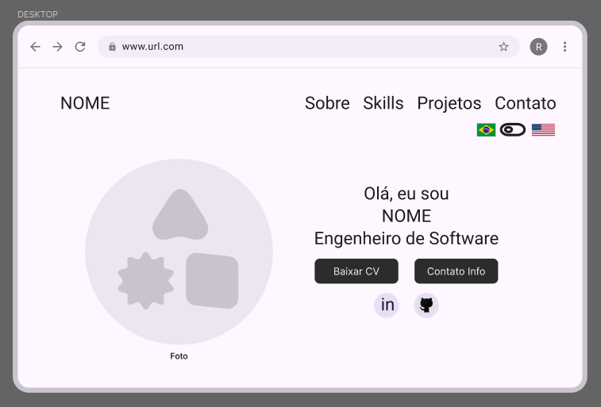
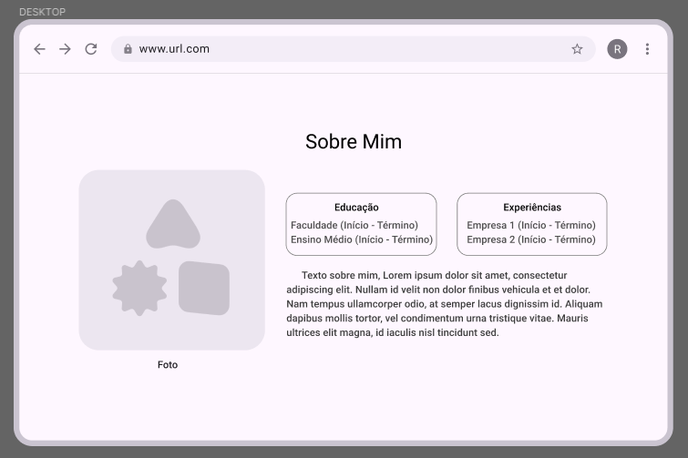
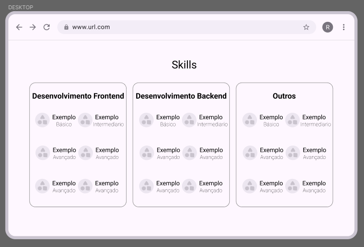
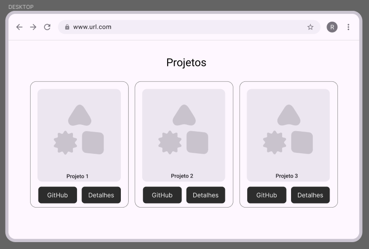
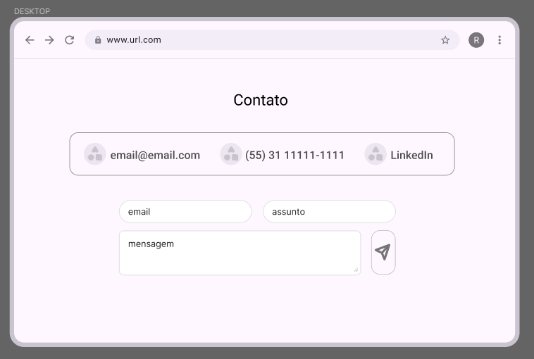

# Portfólio

Olá! Este é meu site Portifólio Pessoal, sou o Arthur Candian, nascido em 2004 e natural de Belo Horizonte. Atualmente, sou estudante de Engenharia de Software na PUC Minas, onde tenho me dedicado a desenvolver habilidades em programação e construção de soluções tecnológicas. Estou em busca de oportunidades para aplicar e expandir meu conhecimento na área de desenvolvimento de software.

O portfólio foi desenvolvido utilizando HTML5 para a estruturação das páginas, CSS3 para a estilização e responsividade, além de JavaScript para adicionar interatividade, como o funcionamento do menu mobile e dos modais de detalhes dos projetos. Também foram utilizadas bibliotecas como Bootstrap para facilitar a criação dos layouts e responsividade.

Link:https://candian15.github.io/Portfolio/

## Estrutura do Projeto

A organização de pastas e arquivos do portfólio está estruturada da seguinte forma:
```
PORTFOLIO
├── assets
│ ├── img
│ ├── mediaqueries.css
│ ├── script.js
│ └── style.css
├── docs
│ ├── prototipo
│ └── wireframes
├── index.html
└── README.md
```

## Wireframes

Os wireframes do projeto foram criados no **Figma** como uma etapa inicial para planejar a disposição dos elementos, a hierarquia visual e a experiência de navegação antes da criação do protótipo e do desenvolvimento.  
Eles serviram como guia para o design final do portfólio.

📌 **Link do Figma:** [Clique aqui para ver no Figma](https://www.figma.com/design/7ENL8HAbRJAoUAiZyN7lLg/Wireframes-Portfolio?node-id=0-1&t=m0PyZFouDLtTgobx-1)

### Imagens dos Wireframes






As imagens estão localizadas na pasta `/docs/wireframes`:
```
docs
└── wireframes
  ├── tela1.png
  ├── tela2.png
  ├── tela3.png
  ├── tela4.png
  └── tela5.png
```

## Protótipo no Figma

Foi criado um protótipo interativo no **Figma** para definir o layout, cores, tipografia e a experiência de navegação do site.  
O vídeo do protótipo demonstra como as páginas foram planejadas e como a navegação foi pensada para ser simples e intuitiva.

📌 **Link do Figma:** [Clique aqui para ver no Figma](https://www.figma.com/design/7ENL8HAbRJAoUAiZyN7lLg/Wireframes-Portfolio?node-id=0-1&t=m0PyZFouDLtTgobx-1)

## Instruções de Uso

1. **Abrir o projeto**
  - Basta abrir pelo link: [[(https://candian15.github.io/Portfolio/)].
  - Ou baixar todo projeto e abrir o arquivo `index.html` em qualquer navegador.
  - O site é responsivo e pode ser acessado tanto em computadores quanto em dispositivos móveis.

2. **Barra de Navegação**
  - O menu superior permite acessar as seções: **Sobre, Skills, Projetos e Contato**.
  - No celular, utilize o **menu hambúrguer** para abrir as opções.
  - O site possui suporte a **idiomas** (Português e Inglês), que podem ser alternados pelos botões `PT` e `EN`.

3. **Funcionalidades principais**
  - **Baixar Currículo**: botão que abre o documento em Google Docs.
  - **Links sociais**: acesso direto ao **LinkedIn** e **GitHub**.
  - **Projetos**: cada projeto possui botão de acesso ao GitHub e modal com detalhes.
  - **Formulário de contato**: envia mensagens via integração com **EmailJS**.
  - **Responsividade**: otimizado para desktop e dispositivos móveis.

## Instruções de Desenvolvimento

1. **Pré-requisitos**
   - Navegador atualizado.  
   - Editor de código (ex.: VSCode).  
   - Internet para carregar EmailJS e dependências externas.  

2. **Estrutura do Projeto**
   - Consulte a seção **Estrutura do Projeto** neste documento para detalhes.  

3. **Scripts**
   - `script.js`: gerencia menu mobile, modais e envio do formulário.  
   - `traducoes.js`: contém os textos em PT/EN e a função `changeLanguage()`.  

4. **Tradução**
   - Elementos com `data-i18n` são traduzidos dinamicamente pelo `traducoes.js`.  

5. **Formulário (EmailJS)**
   - Configure seu **Service ID**, **Template ID** e **Public Key** em `script.js`.

